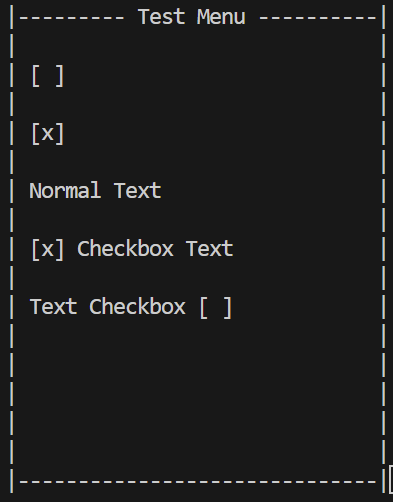

## About The Project

A very simple ASCII terminal graphics library, to 'draw' ASCII drawings to the terminal itself.

It uses ASCII escape codes to clear the terminal and refresh the screen.

The best use scenario would be an escape code-supported terminal, that has Mono-spaced font for a better grid pattern!

</img>

### Built With

* CMake
* Ninja
* Clang

## Getting Started
To get a local copy up and running follow these simple example steps.

### Prerequisites
* CMake
* ASCII Escape Codes supported terminal

### Installation
1. This project can be built with CMake and then linked to an existing project

## Usage
1. Use the Window class for having which current menu is open
2. Inherit from the Menu class and create a custom UI, using the start, update and end virtual functions
3. Use the Draw class static functions to draw different types of ASCII 'drawings'/objects to the Menu

## Roadmap

- [x] Draw Class / Functions for easier 'drawing'

See the [open issues](https://github.com/spiros132/TerminalGraphics/issues) for a full list of proposed features (and known issues).

## Contributing

Contributions make the open source community such an amazing place to learn, inspire, and create. Any contributions you make are **greatly appreciated**.

If you have a suggestion that would make this better, please fork the repo and create a pull request. You can also simply open an issue with the tag "enhancement".
Don't forget to give the project a star! Thanks again!

1. Fork the Project
2. Create your Feature Branch (`git checkout -b feature/AmazingFeature`)
3. Commit your Changes (`git commit -m 'Add some AmazingFeature'`)
4. Push to the Branch (`git push origin feature/AmazingFeature`)
5. Open a Pull Request

## License

Distributed under the MIT License. See `LICENSE.txt` for more information.

## Contact

Spyridon Siarapis - spiros.siarapis@gmail.com

Project Link: [https://github.com/spiros132/TerminalGraphics/](https://github.com/spiros132/TerminalGraphics/)

